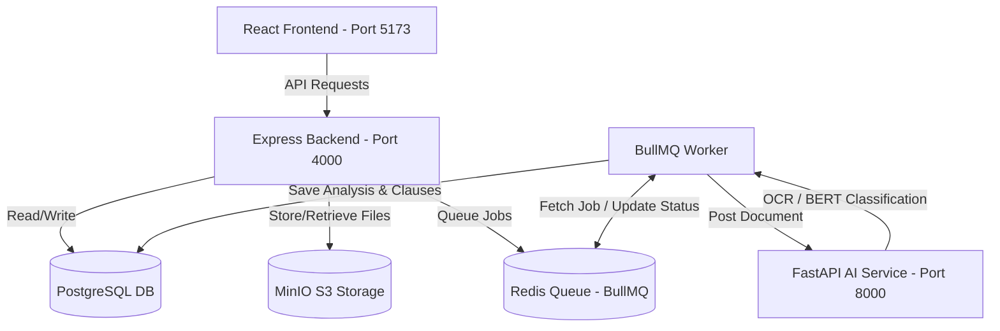

# 📘 LegalEase: Complete Project Documentation

Welcome to the **LegalEase** project documentation! This guide was created specifically to explain, in clear and simple English, the entire architecture, technologies, and concepts behind the LegalEase platform. 

Whether you are looking to understand the overall picture or dive into the smallest technical details, this document covers everything. Since this project was created using "vibe coding," this handbook will bridge any gaps and ensure you are fully in control of the codebase.

---

## 🗺️ Table of Contents
1. [What We Built (The Core Vision)](#1-what-we-built-the-core-vision)
2. [How We Built It (High-Level Architecture)](#2-how-we-built-it-high-level-architecture)
3. [Deep-Dive: The Frontend Application](#3-deep-dive-the-frontend-application)
4. [Deep-Dive: The Backend API Server](#4-deep-dive-the-backend-api-server)
5. [Deep-Dive: The AI/ML Service](#5-deep-dive-the-aiml-service)
6. [Why We Chose This Stack (Technology Comparisons)](#6-why-we-chose-this-stack-technology-comparisons)
7. [Database Schema (The Data Model)](#7-database-schema-the-data-model)
8. [The AI/ML Pipeline: Visualized](#8-the-aiml-pipeline-visualized)

---

## 1. What We Built (The Core Vision)

**LegalEase** is an **AI-powered legal contract analysis platform**. 

### The Problem It Solves
Contracts are long, boring, and filled with dense "legalese" (complex legal language). Hiring a lawyer to read a 50-page agreement to find hidden risks is expensive and slow. If you sign a contract without reading it carefully, you might agree to extreme terms like:
* **Unlimited liability:** If something goes wrong, you could lose everything.
* **Perpetual non-competes:** You can never work for a competitor or start a similar business anywhere in the world forever.
* **Unfair termination clauses:** The other party can end the contract instantly, but you have to give a 90-day notice.

### The Solution
LegalEase lets you upload any contract (as a digital PDF, scanned PDF, or raw image). Within seconds, the system:
1. **Extracts the text** from the file (using advanced OCR if it's a scanned paper/photo).
2. **Splits the contract** into separate readable paragraphs or sections (chunks).
3. **Classifies** each chunk into one of 12 standard legal categories (e.g., Termination, Liability, Confidentiality).
4. **Scores the risk** of each clause using a rule-engine that looks for dangerous keywords and shapes the score.
5. **Calculates an overall risk score** for the contract so you immediately know if it's safe to sign.
6. **Displays the results** in a clean, modern dashboard highlighting exactly what the risky parts say and why they are dangerous.

---

## 2. How We Built It (High-Level Architecture)

The project is structured as a **distributed microservice architecture**. It is split into separate, independent services that talk to each other.



### The Async Worker Pattern (Why we use it)
Analyzing documents and running AI models (especially OCR and deep learning) is CPU-heavy and slow. If a user uploads a PDF and the backend web server tries to run the AI analysis *during the request*, the user's browser will freeze, wait for 30 seconds, and eventually time out. 

To prevent this, we use the **Asynchronous Worker Pattern**:
1. **Upload:** The user uploads a file through the Frontend.
2. **Immediate Success:** The Backend saves the file in MinIO storage, creates a database entry with a status of `uploaded`, queues a job in Redis using **BullMQ**, and tells the frontend *"Got it! I am processing it now"* (Status `201 Created`).
3. **Processing:** The frontend redirects the user to a loading screen (`/processing/:id`) that periodically asks the backend *"Is it done yet?"*
4. **Background Execution:** In the background, a separate Node.js process (the **BullMQ Worker**) picks up the job, changes the database status to `processing`, and calls the **AI Service** via HTTP.
5. **Completion:** The AI Service extracts, chunks, classifies, and scores the contract. It returns the structured JSON data to the worker. The worker saves the results to **PostgreSQL** and updates the document status to `done`.
6. **Display:** The frontend detects the `done` status and renders the beautiful `/results/:id` page.

---

## 3. Deep-Dive: The Frontend Application

Located in: [`/frontend`](file:///c:/Users/hp/OneDrive/Desktop/.vscode/LegalEase/frontend)

The frontend is a single-page application (SPA) built with **React** and **TypeScript**, powered by **Vite** for blazing-fast development builds.

### Key Technologies
* **Vite**: Used instead of Create React App (CRA) because it uses native ES modules to compile code in milliseconds, offering a much faster developer experience.
* **Tailwind CSS**: A utility-first CSS framework. It allows us to build gorgeous, responsive designs right inside the HTML/TSX files without writing separate stylesheet files.
* **Framer Motion**: An animation library used to make page transitions and loading skeletons feel fluid, modern, and premium.
* **Zustand**: A lightweight state management library (simpler and faster than Redux). We use it to store user authentication state, document lists, and active analysis results across components.
* **React Query (`@tanstack/react-query`)**: Manages our server state. It handles automatic caching, refetching, and loading indicators when requesting data from the backend.

### Crucial Feature: Token Interceptors and Auto-Refresh
To avoid asking the user to log in again every 15 minutes, the frontend uses an **Axios interceptor** (`/frontend/src/api/client.ts`):
1. Every time a request is sent, the interceptor automatically attaches the user's `accessToken` to the request headers.
2. If the backend responds with a `401 Unauthorized` (meaning the token has expired), the interceptor pauses all outgoing API requests.
3. It makes a secret request to the backend `/auth/refresh` endpoint using a long-lived `refreshToken` stored in memory.
4. If successful, it receives a fresh `accessToken`, updates the Zustand store, and automatically retries all the paused requests. The user never notices anything happened!

---

## 4. Deep-Dive: The Backend API Server

Located in: [`/backend`](file:///c:/Users/hp/OneDrive/Desktop/.vscode/LegalEase/backend)

The backend is built with **Node.js**, **Express**, and **TypeScript**. It serves as the secure gateway for the application.

### Key Technologies
* **Prisma ORM**: Object-Relational Mapper. Instead of writing raw SQL queries, Prisma lets us write type-safe TypeScript code (`prisma.document.create()`). It also manages our PostgreSQL database tables and migrations automatically.
* **BullMQ & Redis**: BullMQ is a robust queue library for Node.js. It stores pending tasks in Redis (an in-memory database). If the backend crashes, Redis retains the queue so no jobs are lost.
* **Multer**: Express middleware that processes incoming file uploads (`multipart/form-data`) and loads them as temporary memory buffers.
* **AWS SDK S3 Client (`@aws-sdk/client-s3`)**: Used to communicate with MinIO. MinIO is an open-source clone of Amazon S3 that we run locally. We upload the file buffers directly here.
* **Zod**: A schema validation library. It validates incoming user input (e.g. checking if registration emails are valid and passwords are long enough) before the controllers touch them.
* **JSON Web Tokens (JWT)**: Used for secure, stateless user sessions. We issue short-lived Access Tokens (15 minutes) and long-lived Refresh Tokens (7 days) saved in the database.

---

## 5. Deep-Dive: The AI/ML Service

Located in: [`/ai-service`](file:///c:/Users/hp/OneDrive/Desktop/.vscode/LegalEase/ai-service)

The AI/ML service is a **Python FastAPI** microservice. It is dedicated to heavy computational processing: reading PDFs, performing OCR, running deep learning models, and running the risk calculations.

### Core Pipelines

#### 1. Text Extraction Pipeline ([`/ai-service/routers/internal_extract.py`](file:///c:/Users/hp/OneDrive/Desktop/.vscode/LegalEase/ai-service/routers/internal_extract.py))
When a document is uploaded, we must get its raw text. But PDFs are notoriously tricky. We use a hybrid approach:
* **Digital PDFs (Text-Based):** We open the PDF using **PyMuPDF** (`fitz`). If it has readable text (more than 100 characters), we extract it directly. This takes milliseconds.
* **Scanned PDFs & Images (OCR):** If the character count is below 100, the file is likely a scanned photo or image. We run it through a custom **OpenCV Image Processing Pipeline**:
  1. **Corner Detection:** OpenCV searches for the largest 4-sided shape in the image (the paper sheet).
  2. **Perspective Warp:** It warps and flattens the paper crop into a clean rectangle (simulating a flat document scan).
  3. **Deskewing:** It calculates if the lines of text are tilted, and rotates the image to make them perfectly horizontal.
  4. **Contrast Enhancement:** It uses **CLAHE** (Contrast Limited Adaptive Histogram Equalization) on the L-channel of the LAB color space to make text dark and the background bright.
  5. **Tesseract OCR:** Finally, it passes the preprocessed image to **PyTesseract** to read the letters. Preprocessing increases OCR accuracy from ~60% to ~98%.

#### 2. Clause Classification Pipeline ([`/ai-service/classification/classifier.py`](file:///c:/Users/hp/OneDrive/Desktop/.vscode/LegalEase/ai-service/classification/classifier.py))
Once the text is extracted, it is split into chunks of text. We classify each chunk into one of 12 categories (Liability, Governing Law, Termination, etc.):
* **Primary Path (Legal-BERT):** We load a specialized deep learning transformer model from Hugging Face: `nlpaueb/legal-bert-base-uncased`. This model was pre-trained on billions of words from legal contracts and case files.
  - We precompute "prototype vectors" by averaging the BERT embeddings of archetypal sentences for each clause type.
  - We encode the incoming clause chunk into a vector and compute the **Cosine Similarity** between the chunk and our 12 class prototypes.
  - We apply a sharp Softmax function to translate similarities into confidence percentages.
* **Fallback Path (TF-IDF):** If the server runs out of GPU memory or doesn't have PyTorch installed, it falls back to a **TF-IDF Vectorizer** (scikit-learn). It counts word frequencies, weights them, and calculates cosine similarity against the prototypes.

#### 3. Risk Engine Pipeline ([/ai-service/classification/risk_scoring.py](file:///c:/Users/hp/OneDrive/Desktop/.vscode/LegalEase/ai-service/classification/risk_scoring.py))
Once a clause is classified, we calculate its risk score (0 to 100):
1. **Base Score:** Each clause type has a starting risk score (e.g., `non_compete` starts at 70, while `severability` starts at 10).
2. **Keyword Rules:** We run keyword checks. For example, if a `termination` clause contains the words *"convenience"* or *"without cause"*, we add `+20` to the risk score. If it contains *"30 days notice"*, we subtract `-10`.
3. **Confidence Adjustment:** If the BERT classifier has low confidence in its classification (`< 40%`), we blend the calculated score toward a safe medium risk of `35` to avoid false positives.
4. **Overall Score Aggregation:** How do we combine the scores of 20 clauses into one overall contract score? A simple average is dangerous: if a contract has 19 safe clauses (score 10) and 1 highly dangerous clause (score 100), the average is only `18` (low risk). To prevent this dilution, we use a weighted formula:
   $$\text{Overall Score} = (0.6 \times \text{Average Clause Score}) + (0.4 \times \text{Max Clause Score})$$
   This guarantees that a single high-risk clause pulls the entire contract score up to reflect potential danger.

---

## 6. Why We Chose This Stack (Technology Comparisons)

When building this project, we chose these technologies over common alternatives. Here is why:

| Technology Chosen | Alternative Considered | Why Chosen |
| :--- | :--- | :--- |
| **Node.js (Express)** | Python (Django/Flask) | Node.js handles asynchronous API calls, websockets, and concurrent user routing much faster with a lower memory footprint. We keep Python strictly for AI tasks. |
| **FastAPI** | Flask / Django | FastAPI is asynchronous, runs 2-3x faster than Flask, has native data validation (Pydantic), and automatically generates Interactive API documentation (`/docs`). |
| **Prisma ORM** | TypeORM / Sequelize | Prisma generates actual TypeScript types based on our database schemas, preventing us from writing queries that request fields that do not exist. |
| **BullMQ** | Celery / RabbitMQ | BullMQ runs natively in Node.js, uses Redis (which we already use for caching), and requires zero complex setups like Celery does. |
| **MinIO** | Local Folder / Disk Storage | Local storage crashes if your container restarts. MinIO simulates Amazon S3. In production, we can switch to AWS S3 by changing only one line in the `.env` file without changing any code. |
| **Legal-BERT** | OpenAI GPT API | Running a local transformer like Legal-BERT is completely free, does not violate client-attorney privilege by sending sensitive contracts to third-party servers, and is highly specialized. |

---

## 7. Database Schema (The Data Model)

Here is a simplified layout of the database tables managed by **Prisma** in PostgreSQL:

```
[users]
  - id (UUID, Primary Key)
  - name (String)
  - email (String, Unique)
  - password_hash (String)
  - created_at (Timestamp)

[refresh_tokens]
  - id (UUID, Primary Key)
  - user_id (FK -> users.id)
  - token_hash (String)
  - expires_at (Timestamp)
  - revoked_at (Timestamp, Nullable)

[documents]
  - id (UUID, Primary Key)
  - user_id (FK -> users.id)
  - filename (String)
  - s3_key (String)
  - status (Enum: uploaded, processing, done, failed)
  - created_at (Timestamp)

[analyses]
  - id (UUID, Primary Key)
  - document_id (FK -> documents.id)
  - overall_risk_score (Integer)
  - model_version (String)
  - created_at (Timestamp)

[clauses]
  - id (UUID, Primary Key)
  - analysis_id (FK -> analyses.id)
  - clause_type (Enum: liability, termination, indemnity, etc.)
  - risk_level (Enum: low, medium, high)
  - risk_score (Integer, 0 to 100)
  - original_text (Text)
  - explanation (Text)
```

### Relationship Path
A **User** uploads many **Documents**. Each **Document** has a status. When the status is `done`, it points to one **Analysis**. The **Analysis** contains a list of classified **Clauses**, detailing the individual risks, original text snippets, and explanations.

---

## 8. The AI/ML Pipeline: Visualized

Here is a step-by-step trace of what happens to a contract file after upload:

```
  [ Uploaded File ]
         │
         ▼
  [ Check PDF Type ] ─── Chars < 100? (Scanned/Image) ───► [ OpenCV Image Preprocessing ]
         │                                                            │
         │ Chars >= 100 (Digital)                                     ▼
         │                                                    [ PyTesseract OCR ]
         ▼                                                            │
  [ Extract Plain Text ] ◄─────────────────────────────────────────────┘
         │
         ▼
  [ Text Splitter (Chunking) ] ──► [ LangChain Chunk Segments ]
                                              │
                                              ▼
                                   [ Clause Classification ]
                                   ├─ Legal-BERT (Vector Similarity)
                                   └─ TF-IDF + Cosine Sim (Fallback)
                                              │
                                              ▼
                                   [ Risk Rule Engine ]
                                   ├─ Match Keyword Rules
                                   └─ Apply Confidence Blend
                                              │
                                              ▼
                                   [ Aggregate Document Risk ]
                                   └─ 60% Avg + 40% Max Weighting
                                              │
                                              ▼
                                   [ Store results in DB ]
```

With this documentation, you now understand the exact core logic of the entire project! Feel free to review the codebase knowing how these files interact.
