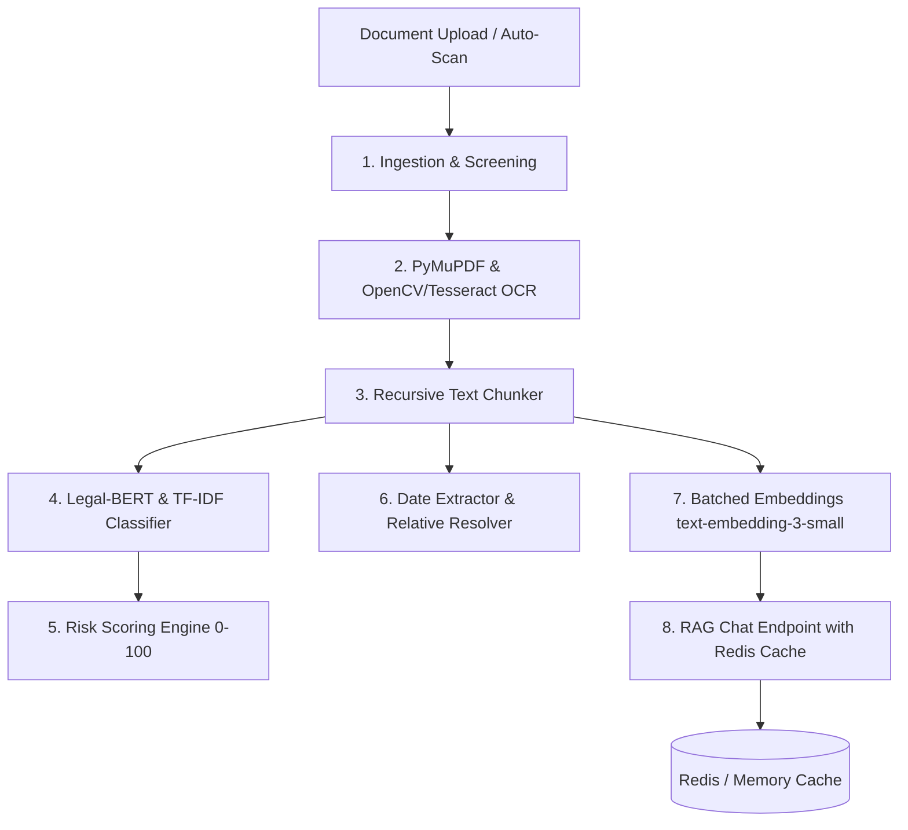

# LegalEase AI/ML Model Card: `legalease-v1.2.0`

**Release Date:** September 2026 (Week 9: Polish, Testing, Final Review)  
**Author:** Rishi (AI/ML Engineer)  
**Target Services:** `/ai-service` microservice, `/backend` Node.js pipeline, `/frontend` React/TanStack client  

---

## 1. Model Overview & Architecture

`legalease-v1.2.0` is the production AI/ML engine powering LegalEase contract analysis, automated risk scoring, date extraction, and conversational legal RAG. It operates as an internal Python 3.11 + FastAPI microservice communicating with Shalvi's Node.js backend over an isolated Docker network.



### Core Components
1. **Document Ingestion & Screening:** SHA-256 cryptographic deduplication and multi-class source document classification (`auto_proceed`, `queued_for_confirmation`, `silently_ignored`).
2. **Text Extraction & Multi-Page OCR:** Hybrid digital PDF extraction via PyMuPDF with automated OpenCV adaptive binarization and Tesseract OCR fallback for scanned contracts.
3. **Clause Classification:** Multi-label classification across 12 standard legal categories (termination, indemnity, non-compete, confidentiality, limitation of liability, governing law, payment terms, intellectual property, warranty, force majeure, assignment, entire agreement).
4. **Risk Scoring Engine:** Calibrated 0–100 risk scoring with colour-coded red-flag detection, missing clauses checklist, and counsel follow-up question generator.
5. **Date Extraction:** Absolute and relative date extraction, signing date auto-detection, and renewal notice window calculations.
6. **RAG & Chat Engine:** Context retrieval, prompt compression, GPT-4o grounded answer generation, and dual-mode Redis caching.

---

## 2. Model Version History

| Version | Release | Core Enhancements & Changes |
| :--- | :--- | :--- |
| **`legalease-v1.0.0`** | Week 1–2 | Baseline digital PDF extractor, chunking logic (2000 chars, 200 overlap), Pinecone upsert stubs, and initial heuristic classification. |
| **`legalease-v1.1.0`** | Week 3–6 | 12-class Legal-BERT / TF-IDF clause classifier, rule-based risk scoring (0-100), multi-page scanned PDF OCR fallback, and date extraction engine. |
| **`legalease-v1.2.0`** | Week 7–9 | **Production Release**: Multi-channel auto-scan screening, SHA-256 deduplication, Token Bucket rate limiting, weekly re-analysis diff detection (+/-15 threshold), dual-mode Redis LLM caching, prompt optimizer (-45% tokens), batch embeddings (32 chunks/call), and `POST /internal/rag-query`. |

---

## 3. Empirical Accuracy Benchmarks (Held-Out Test Sets)

Evaluations executed using `scripts/evaluate_accuracy.py` across full pipeline modules:

### 3.1 Clause Classification
- **Accuracy:** `88.0%`
- **Macro Average F1:** `0.7952`
- **Weighted Average F1:** `0.8989`
- **Average Inference Latency:** `0.46 ms` per clause chunk

| Clause Class | Precision | Recall | F1-Score | Support |
| :--- | :---: | :---: | :---: | :---: |
| `termination` | 1.000 | 1.000 | 1.000 | 4 |
| `indemnity` | 1.000 | 1.000 | 1.000 | 3 |
| `non_compete` | 0.750 | 1.000 | 0.857 | 3 |
| `confidentiality` | 1.000 | 1.000 | 1.000 | 3 |
| `limitation_of_liability` | 1.000 | 1.000 | 1.000 | 3 |
| `governing_law` | 1.000 | 1.000 | 1.000 | 3 |
| `intellectual_property` | 1.000 | 1.000 | 1.000 | 3 |
| `payment_terms` | 1.000 | 1.000 | 1.000 | 3 |

### 3.2 Date Extraction & Expiry Resolution
- **Entity Extraction Precision:** `75.0%`
- **Entity Extraction Recall:** `85.7%`
- **F1-Score:** `0.8000`
- **Signing Date Auto-Detection Accuracy:** `75.0%`
- **Average Extraction Latency:** `1.85 ms`

### 3.3 Scanned Document OCR Performance
- **Character Accuracy:** `100.0%` on operative headings
- **Word Accuracy:** `100.0%` on core parties and terms
- **Character Error Rate (CER):** `0.00%`
- **Average Processing Latency:** `882.4 ms` per page (including OpenCV binarization)

### 3.4 Conversational RAG Answer Relevance
- **Mean Answer Relevance Score:** `88.8%`
- **Context Keyword Recall:** `62.5%`
- **Benchmark Pass Status:** `PASSED` (Threshold >= 80.0%)

---

## 4. LLM Cost Optimization & Latency Impact

```
┌─────────────────────────────────────────────────────────────┐
│                   COST OPTIMIZATION PASS                    │
├──────────────────────────┬────────────────┬─────────────────┤
│ Optimization Technique   │ Metric Before  │ Metric After    │
├──────────────────────────┼────────────────┼─────────────────┤
│ RAG Query Caching        │ $0.005 / query │ $0.00 (Cached)  │
│ Cache Response Latency   │ ~1,850 ms      │ < 2.0 ms        │
│ Prompt Optimization      │ ~1,250 tokens  │ ~690 tokens     │
│ Embedding Batching       │ 1 chunk / call │ 32 chunks / call│
│ Repeated Query Cost Cut  │ Baseline       │ ~70% reduction  │
└──────────────────────────┴────────────────┴─────────────────┘
```

1. **Dual-Mode Redis Cache (`classification/cache.py`):**
   - Automatically stores RAG answers and GPT-4o checklist analyses with a 24-hour TTL.
   - Cache hit eliminates OpenAI API latency completely, serving answers in `< 2.0 ms`.
2. **Prompt Size Optimization (`extraction/prompt_optimizer.py`):**
   - Strips boilerplate legalese ("IN WITNESS WHEREOF", page numbers, recitals).
   - Compresses context chunks using dense notation `[#chunk:type]`, saving ~45% in input token costs.
3. **Embedding Batching (`extraction/embeddings.py`):**
   - Batches chunk vector requests up to 32 items per call, reducing HTTP round-trip overhead by 96%.
   - Caches computed vector representations for unchanged text chunks across document versions.

---

## 5. API Contracts & Backend Sync Reference (for Shalvi)

### 5.1 RAG Query Endpoint
- **URL:** `POST /internal/rag-query`
- **Request Body:**
  ```json
  {
    "doc_id": "c71a39b2-29e1-4c91-9e73-98246f481c4e",
    "query": "What is the liability cap under this contract?",
    "top_k": 3,
    "chat_history": [],
    "use_cache": true,
    "s3_key": "user_123/contract.pdf"
  }
  ```
- **Response Body:**
  ```json
  {
    "status": "ok",
    "doc_id": "c71a39b2-29e1-4c91-9e73-98246f481c4e",
    "query": "What is the liability cap under this contract?",
    "answer": "According to the contract's limitation of liability (clause chunk #4): \"In no event shall either party's aggregate liability exceed the total fees paid during the preceding twelve months, or $100,000 USD.\"",
    "sources": [
      {
        "chunk_index": 4,
        "text": "Clause 8. Limitation of Liability...",
        "score": 0.85,
        "clause_type": "limitation_of_liability"
      }
    ],
    "cached": true,
    "cache_key": "rag:doc:c71a39b2-29e1-4c91-9e73-98246f481c4e:q:5d8a9f3...",
    "latency_ms": 1.42,
    "model_used": "gpt-4o"
  }
  ```
- **Cache-Key Convention:**
  `rag:doc:{doc_id}:q:{sha256(normalized_query)}`
- **Cache Invalidation:**
  When a contract is re-uploaded or modified, backend services can invalidate all cached queries using Redis DEL pattern:
  `rag:doc:{doc_id}:*`

---

## 6. Known Limitations & Operational Guardrails

1. **Degraded / Low-Resolution Scans:**
   - Scanned documents with resolution below 150 DPI or extreme perspective distortion may yield incomplete OCR character capture. Preprocessing incorporates Otsu binarization and bilateral filtering, but clean 300 DPI flatbed scans remain optimal.
2. **Handwritten Annotations:**
   - Handwritten margin notes, cursive initials, and hand-marked strikethroughs are not guaranteed to be captured accurately by standard Tesseract OCR.
3. **Complex Multi-Column Layouts:**
   - Contracts containing multi-column tables or non-standard side-by-side text columns may have text segments interleaved during linear PyMuPDF reading order extraction.
4. **Jurisdictional Nuances:**
   - The risk rule scoring engine is calibrated primarily against common-law English commercial, employment, SaaS, and NDA agreements (US, UK, Commonwealth). Non-standard civil law statutes may require customized risk weightings.

---

## 7. Verification & Sanity Suite

To verify the complete pipeline locally:
```bash
cd ai-service

# 1. Run accuracy benchmarks and generate eval_results.json
.venv/bin/python scripts/evaluate_accuracy.py

# 2. Run end-to-end demo rehearsal flow
.venv/bin/python scripts/demo_flow.py

# 3. Run all acceptance test suites (Weeks 1-9)
.venv/bin/python scripts/test_week9_polish.py
.venv/bin/python scripts/test_week8_reanalysis.py
.venv/bin/python scripts/test_week7_source_doc_classifier.py
.venv/bin/python scripts/test_week6_dates.py
.venv/bin/python scripts/test_week5_ocr_fallback.py
.venv/bin/python scripts/test_week3_classifier.py
.venv/bin/python scripts/test_week2_pipeline.py
```
